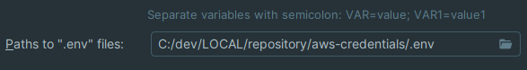

# Robot de Automatización para actualizar credenciales AWS

Consta de conectar directamente con AWS para configurar/actualizar las credenciales de la cuenta AWS.

> DOCKERIZARLO ES POR BUENAS PRACTICAS PERO NO HARIA FALTA PORQUE SIEMPRE SE VA A EJECUTAR EN LOCAL

## Requisitos

- Python 3.9 o superior
- [Google Chrome](https://www.google.com/chrome/) y [ChromeDriver](https://sites.google.com/a/chromium.org/chromedriver/) compatibles con la
  versión de Chrome instalada.
- Dependencias de Python listadas en `requirements.txt`

## Crear y activar un entorno virtual de Python:

### 1. MacOS

```bash
python -m venv venv
source venv/bin/activate
pip install -r requirements.txt
py ./run.py
```

### 2. Windows

```bash
py -m venv venv
venv\Scripts\activate
pip install -r requirements.txt
py ./run.py
```

## Instalar las dependencias:

```bash
pip install -r requirements.txt
```

## Variables de entorno

Se debe de configurar en `.env`:

- `AWS_ENV`: Variable que hace alusion al perfil asociado a un environment (Por ejemplo: aws.XXXX.dev).
- `AWS_PROFILE`: Nombre del profile.
- `Company_USER`: Usuario de empresa.
- `Company_PWD`: Password de empresa.
- `IMPORT_SQS`: Importa en local las colas SQS asociadas a DEV (True/False).
- `AWS_REGION`: Region local (eu-west-1).



## Ejecutar para que al levantar el contenedor actualice las variables de tu maquina:

docker build -t aws-credentials .
docker run -v ~/.aws:/root/.aws aws-credentials